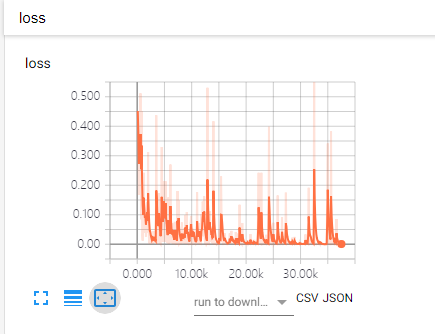
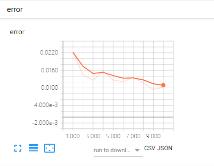

# A clean and beautiful template for pytorch

## How to use

### 1) Modify `template.py`

Replace the content in the `__init__`method. 

``` python
class Model():

    def __init__(self, args):
        self.writer = tX.SummaryWriter(log_dir=None, comment='')
        self.train_logger = None  # not neccessary
        self.eval_logger = None  # not neccessary
        self.args = args  # not neccessary

        self.step = 0
        self.epoch = 0
        self.best_error = float('Inf')

        self.model = None
        self.optimizer = None
        self.criterion = None
        self.metric = None

        self.train_loader = None
        self.test_loader = None

        self.device = None

        self.ckpt_dir = None
        self.log_per_step = None
```


### 2) Write traning loop

And then all you need is to write a little traning loop like this:

``` python
model = Model()

for epoch in range(n_epochs):
    model.train()
    if (epoch + 1) % eval_per_epoch == 0:
        model.eval()

print('Done!!!')
```

### 3) Resume traning

Resume traning is very convenient, just need to load the saved model.

``` python
model = Model()
if model_path:
    model.load_state(model_path)

for i in range(n_epochs):
    model.train()
    if model.epoch % eval_per_epoch == 0:
        model.eval()
```


## Example

- [LeNet](example/LeNet): Train a LeNet to classify MNIST handwrting digits.

    - Training procedure:

        ``` shell
        ......
        epoch 1 step 3400   loss 0.0434
        epoch 1 step 3500   loss 0.0331
        epoch 1 step 3600   loss 0.00188
        epoch 1 step 3700   loss 0.00341
        save model at ../models\best.pth.tar
        save model at ../models\1.pth.tar
        epoch 1 error 0.0237
        epoch 2 step 3800   loss 0.0201
        epoch 2 step 3900   loss 0.00523
        epoch 2 step 4000   loss 0.0236
        ......
        ```

    - Use tensorboard to visualize the result:

        ```shell
        tensorboard --logdir example/LeNet/log
        ```

        | train_loss                                      | eval_error                                      |
        | ----------------------------------------------- | ----------------------------------------------- |
        |  |  |

    - Resume

        ``` shell
        load model from checkpoint/9.pth.tar
        epoch 10    step 33800  loss 0.000128
        epoch 10    step 33900  loss 6.64e-06
        epoch 10    step 34000  loss 0.000613
        epoch 10    step 34100  loss 2.41e-05
        ......
        ```


